# Java Tetris Game


## Overview
This is a modern implementation of the classic Tetris game using Java Swing. The game features a clean, modern UI with smooth animations and all the standard Tetris mechanics including piece holding, ghost pieces, and scoring system.

## Features
- 🎮 Classic Tetris gameplay
- 🎨 Modern UI with smooth animations
- 👻 Ghost piece preview
- 💾 Hold piece functionality
- 📊 Score tracking and level progression
- 🎯 Next piece preview
- ⏯️ Pause functionality
- 🎨 Custom block colors and styling

## Game Controls
- **Left Arrow**: Move piece left
- **Right Arrow**: Move piece right
- **Down Arrow**: Soft drop
- **Up Arrow**: Rotate piece
- **Space**: Hard drop
- **C**: Hold piece
- **P**: Pause game

## Game Mechanics

### Scoring System
The scoring system follows the classic Tetris rules:
- 1 line cleared: 100 × level
- 2 lines cleared: 300 × level
- 3 lines cleared: 500 × level
- 4 lines cleared: 800 × level (Tetris)
- Hard drop: 2 points per cell dropped

### Level Progression
- Level increases every 10 lines cleared
- Game speed increases with each level
- Starting speed: 500ms per drop
- Minimum speed: 100ms per drop
- Speed reduction: 50ms per level

## Implementation Details

### Class Structure


### Game Flow


### Piece Types and Rotations

```mermaid
graph TD
    %% I-Piece
    I[I-Piece<br/>Cyan] --> I1[0°<br/>⬛⬛⬛⬛]
    I --> I2[90°<br/>⬛<br/>⬛<br/>⬛<br/>⬛]
    I --> I3[180°<br/>⬛⬛⬛⬛]
    I --> I4[270°<br/>⬛<br/>⬛<br/>⬛<br/>⬛]

    %% J-Piece
    J[J-Piece<br/>Blue] --> J1[0°<br/>⬛<br/>⬛⬛⬛]
    J --> J2[90°<br/>⬛⬛<br/>⬛<br/>⬛]
    J --> J3[180°<br/>⬛⬛⬛<br/>  ⬛]
    J --> J4[270°<br/> ⬛<br/> ⬛<br/>⬛⬛]

    %% L-Piece
    L[L-Piece<br/>Orange] --> L1[0°<br/>  ⬛<br/>⬛⬛⬛]
    L --> L2[90°<br/>⬛<br/>⬛<br/>⬛⬛]
    L --> L3[180°<br/>⬛⬛⬛<br/>⬛]
    L --> L4[270°<br/>⬛⬛<br/> ⬛<br/> ⬛]

    %% O-Piece
    O[O-Piece<br/>Yellow] --> O1[0°<br/>⬛⬛<br/>⬛⬛]
    O --> O2[90°<br/>⬛⬛<br/>⬛⬛]
    O --> O3[180°<br/>⬛⬛<br/>⬛⬛]
    O --> O4[270°<br/>⬛⬛<br/>⬛⬛]

    %% S-Piece
    S[S-Piece<br/>Green] --> S1[0°<br/> ⬛⬛<br/>⬛⬛]
    S --> S2[90°<br/>⬛<br/>⬛⬛<br/> ⬛]
    S --> S3[180°<br/> ⬛⬛<br/>⬛⬛]
    S --> S4[270°<br/>⬛<br/>⬛⬛<br/> ⬛]

    %% T-Piece
    T[T-Piece<br/>Purple] --> T1[0°<br/> ⬛<br/>⬛⬛⬛]
    T --> T2[90°<br/>⬛<br/>⬛⬛<br/>⬛]
    T --> T3[180°<br/>⬛⬛⬛<br/> ⬛]
    T --> T4[270°<br/> ⬛<br/>⬛⬛<br/> ⬛]

    %% Z-Piece
    Z[Z-Piece<br/>Red] --> Z1[0°<br/>⬛⬛<br/> ⬛⬛]
    Z --> Z2[90°<br/> ⬛<br/>⬛⬛<br/>⬛]
    Z --> Z3[180°<br/>⬛⬛<br/> ⬛⬛]
    Z --> Z4[270°<br/> ⬛<br/>⬛⬛<br/>⬛]

    %% Styles
    classDef iPiece fill:#00FFFF,stroke:#000,stroke-width:2px,color:#000
    classDef jPiece fill:#0000FF,stroke:#000,stroke-width:2px,color:#fff
    classDef lPiece fill:#FFA500,stroke:#000,stroke-width:2px,color:#000
    classDef oPiece fill:#FFFF00,stroke:#000,stroke-width:2px,color:#000
    classDef sPiece fill:#00FF00,stroke:#000,stroke-width:2px,color:#000
    classDef tPiece fill:#800080,stroke:#000,stroke-width:2px,color:#fff
    classDef zPiece fill:#FF0000,stroke:#000,stroke-width:2px,color:#fff
    classDef rotation fill:#f0f0f0,stroke:#000,stroke-width:1px,color:#000,font-family:monospace

    %% Apply styles
    class I iPiece
    class J jPiece
    class L lPiece
    class O oPiece
    class S sPiece
    class T tPiece
    class Z zPiece
    class I1,I2,I3,I4,J1,J2,J3,J4,L1,L2,L3,L4,O1,O2,O3,O4,S1,S2,S3,S4,T1,T2,T3,T4,Z1,Z2,Z3,Z4 rotation
```


### Piece Statistics
| Piece | Color | Size | Rotations | Spawn Point | Wall Kicks |
|-------|-------|------|-----------|-------------|------------|
| I     | Cyan  | 4x1  | 2         | (3,0)       | 5          |
| J     | Blue  | 3x2  | 4         | (3,0)       | 4          |
| L     | Orange| 3x2  | 4         | (3,0)       | 4          |
| O     | Yellow| 2x2  | 1         | (4,0)       | 1          |
| S     | Green | 3x2  | 2         | (3,0)       | 4          |
| T     | Purple| 3x2  | 4         | (3,0)       | 4          |
| Z     | Red   | 3x2  | 2         | (3,0)       | 4          |

## Technical Details

### Board Dimensions
- Width: 10 cells
- Height: 20 cells
- Block Size: 30 pixels
- Border Width: 5 pixels

### Piece Rotation System
The game implements a wall kick system for piece rotation:
1. Attempts standard rotation
2. If blocked, tries shifting left/right
3. If still blocked, tries shifting up
4. If all attempts fail, rotation is cancelled

### Collision Detection
The game uses a grid-based collision system:
- Checks board boundaries
- Checks for overlapping pieces
- Handles piece placement
- Manages line clearing

## Requirements
- Java Runtime Environment (JRE) 8 or higher
- Java Development Kit (JDK) 8 or higher for development

## How to Run
1. Compile the Java file:
```bash
javac tetris.java
```
2. Run the compiled class:
```bash
java Tetris
```

## Future Improvements
- High score system
- Custom themes
- Sound effects
- Multiplayer support
- Mobile port

## Credits
- Game Design & Implementation: Ioannis Morfidis
- Original Tetris Concept: Alexey Pajitnov
- Java Swing Framework: Oracle Corporation


---
## Author
*Created by John Morfidis* 
